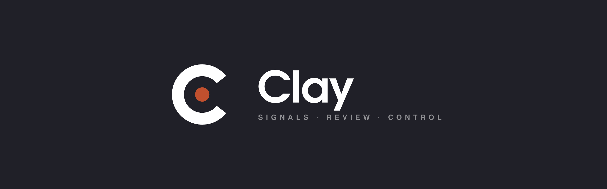

<p align="center">
  <picture>
    <source media="(prefers-color-scheme: dark)" srcset="brand/banner-dark.png">
    <source media="(prefers-color-scheme: light)" srcset="brand/banner-light.png">
    
  </picture>
</p>

# Clay

**Your own trading workspace. Signals, review, and control.**

[](https://github.com/newvogue-labs/clay/actions/workflows/ci.yml)
[](https://newvogue-labs.github.io/clay/)
[](LICENSE)
[](https://www.python.org/)
[](https://github.com/astral-sh/ruff)

> [!IMPORTANT]
> **Clay is an advisory workspace, not an autonomous trading bot.**
> Every signal, recommendation, and AI-generated insight is meant for **human review only**.
> Real-money execution requires an explicit, operator-gated approval step — there is no silent auto-trading path.
> The `#knowledge` base provides advisory context; it is **never** injected into the execution or control path (ADR-030, M278).

## What is Clay

Clay is a local-first trading workspace built around one principle: **you see everything, you approve everything**.

It combines market data ingestion, AI-assisted signal generation, structured session control, and a knowledge base — all surfaced through a web UI where an operator reviews and confirms every action before it takes effect.

**Key properties:**

- **Backend = Source of Truth.** The frontend is a read-oriented shell; all state, decisions, and transitions live in the backend.
- **Advisory AI.** LLM-generated signals, knowledge retrieval, and session briefings are information layers — they never bypass the operator.
- **Operator-first control flow.** Model assignments, session transitions, and strategy activation all require explicit review-and-apply steps.
- **Local-first.** Runs on your machine with PostgreSQL/TimescaleDB. No cloud dependency for core functionality.

**Out of Scope:**

- Automated order execution (Clay does not place trades)
- Portfolio-level risk management or accounting
- Multi-exchange aggregation (Binance Spot is the current target)
- Real-time low-latency market making

## Status

| Area | Status | Notes |
|------|--------|-------|
| Runtime & lifecycle | Working | States, transitions, config management |
| Data ingestion | Working | Binance Spot klines, news, sentiment connectors |
| Trading workspace | Working | Signal ranking, pair focus, live refresh via SSE |
| AI control | Working | Role registry, model assignment review/apply |
| Signal engine | Working | Lifecycle, confidence, risk triggers |
| Session control | Working | Preflight, briefing, pause/resume, pair replacement |
| Demo trading | Working | Manual trade logging, outcome tracking |
| Session review | Working | Audit, feedback, AI-assisted review |
| Knowledge base | Working | Advisory vault, sync pipeline, retrieval |
| Validation lab | Working | Replay runs, staged activation review |
| Reliability center | Working | Degraded mode, readiness checks, release gates |
| Notion mirror | Working | Vault → Notion publish pipeline (dry-run) |
| MkDocs documentation | Live | [newvogue-labs.github.io/clay](https://newvogue-labs.github.io/clay/) |
| Real-money execution | Roadmap | Operator-gated, requires replay evidence |
| Multi-exchange | Out of scope | — |
| Automated trading | Out of scope | — |

## Architecture at a glance

```
┌─────────────────────────────────────────────────────┐
│                   Frontend (React)                   │
│  Trading Workspace · AI Control · Session · Review   │
└──────────────────────┬──────────────────────────────┘
                       │ REST + SSE
┌──────────────────────▼──────────────────────────────┐
│                  Backend (FastAPI)                   │
│  ┌──────────┐ ┌──────────┐ ┌──────────┐ ┌────────┐ │
│  │ Market   │ │ Signal   │ │ Session  │ │ Knowl- │ │
│  │ Ingest   │ │ Engine   │ │ Control  │ │ edge   │ │
│  └──────────┘ └──────────┘ └──────────┘ └────────┘ │
│  ┌──────────┐ ┌──────────┐ ┌──────────┐            │
│  │ Demo     │ │ Session  │ │ Validat- │            │
│  │ Trading  │ │ Review   │ │ ion Lab  │            │
│  └──────────┘ └──────────┘ └──────────┘            │
└──────────────────────┬──────────────────────────────┘
                       │
┌──────────────────────▼──────────────────────────────┐
│           PostgreSQL / TimescaleDB                   │
└─────────────────────────────────────────────────────┘
```

Full architecture diagrams (C4 System Context, Module Map, Trading Cycle, Data Flow, systemd Boot Chain) are in the [Architecture Maps](https://newvogue-labs.github.io/clay/architecture-maps/) section of the docs.

## Quickstart

> **Prerequisites:** [mise](https://mise.jdx.dev/) (or manual Python 3.14 + Node 22 + pnpm), Docker or Podman for TimescaleDB.

**1. Clone and install dependencies:**

```bash
git clone https://github.com/newvogue-labs/clay.git
cd clay
mise install          # or install Python 3.14 + Node 22 + pnpm manually
make backend-install  # uv sync
make frontend-install # pnpm install
```

**2. Start the database:**

```bash
cp .env.example .env
# Set CLAY_DB_PASSWORD in .env, then:
podman volume create clay_pgdata
podman compose up -d
```

**3. Run migrations and start the backend:**

```bash
cd backend && uv run alembic upgrade head && cd ..
make backend-run      # http://127.0.0.1:8000
```

**4. Start the frontend dev server:**

```bash
make frontend-run     # http://127.0.0.1:5173
```

**5. Run the full test suite (sanity check):**

```bash
make check            # lint + format-check + backend-test + frontend-typecheck + frontend-test
```

### Safe demo mode

Clay ships with demo connectors for news and sentiment data, and a demo trading surface for manual trade logging. No API keys or live market connections are required to explore the workspace — set `CLAY_BINANCE_SPOT_ENABLED=false` in `.env` to skip live market fetches.

## Documentation

| Resource | Link |
|----------|------|
| **Live docs** | [newvogue-labs.github.io/clay](https://newvogue-labs.github.io/clay/) |
| **Architecture Decisions (ADR)** | [ADR index](https://newvogue-labs.github.io/clay/adr/) — 14 decisions (016–031) |
| **Runbooks** | [Runbooks](https://newvogue-labs.github.io/clay/mission-control/deploy-runbook/) — deploy, preflight, degraded mode, kill-switch, LiteLLM gateway |
| **Architecture Maps** | [D1–D4](https://newvogue-labs.github.io/clay/architecture-maps/) — system context, module map, trading cycle, data flow |
| **Tags** | [Tag index](https://newvogue-labs.github.io/clay/tags/) — 8 domain tags across all public pages |
| **LLM-friendly** | [`llms.txt`](https://newvogue-labs.github.io/clay/llms.txt) and per-page `.md` variants for AI consumption |

## Repo layout

```
clay/
├── backend/          # FastAPI application, domain logic, tests
│   ├── src/clay/     # Source package
│   ├── tests/        # Pytest suite
│   └── alembic/      # Database migrations
├── frontend/         # React + Vite + Tailwind application
│   ├── src/          # Source
│   └── tests/        # Vitest suite
├── docs/             # MkDocs Material source
│   ├── adr/          # Architecture Decision Records
│   ├── architecture-maps/  # Mermaid diagrams
│   └── mission-control/    # Runbooks, blueprints, planning
├── deploy/
│   ├── systemd/      # Service units (as-deployed)
│   └── litellm/      # LiteLLM gateway config
├── compose.yaml      # TimescaleDB container
├── Makefile          # Dev workflow targets
└── mkdocs.yml        # Documentation site config
```

## Invariants & Safety Model

These properties are structurally enforced, not just documented:

| Invariant | Enforcement |
|-----------|-------------|
| **M278: knowledge is advisory-only** | `EXCLUDED_TAGS` barrier prevents execution-tagged cards from reaching chief-agent prompt; 0 violations across ablation eval |
| **Signal ≠ Execution** | `signal_engine` produces ranked signals with risk metadata; order placement does not exist in the codebase |
| **Human-in-the-loop** | Session transitions, model assignment changes, and strategy activation all require explicit review → apply flow |
| **Backend = Source of Truth** | Frontend is a read-oriented shell; all state transitions, audit events, and decisions live in backend services |
| **Release gates are visible** | Reliability Center exposes `blocked` / `needs_attention` / `ready_for_demo` instead of silent assumptions |
| **Vault sync is idempotent** | `external_id` + UNIQUE constraint + upsert prevents ghost records on re-sync |

See [ADR-025 (Execution Layer & Real-Money Gate)](https://newvogue-labs.github.io/clay/adr/025-execution-layer-and-real-money-gate/) and [ADR-030 (Advisory Knowledge)](https://newvogue-labs.github.io/clay/adr/030-advisory-knowledge-chief-agent/) for the full safety rationale.

## Contributing

See [CONTRIBUTING.md](CONTRIBUTING.md) for development setup, coding standards, and PR workflow.

## License

This project is licensed under the [MIT License](LICENSE).

## Disclaimer

Clay is experimental software for educational and research purposes. It does not provide financial advice. Trading cryptocurrencies involves significant risk. The authors and contributors are not responsible for any financial losses incurred through the use of this software.
