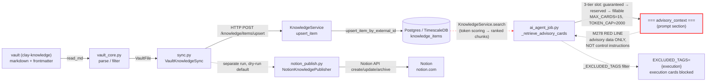

# D4 — Data-flow: vault → #knowledge → Notion → advisory (M278)



### M278 red-line invariant

```
#knowledge → advisory_context = справочные данные, НЕ инструкции.
Retrieval path: ai_agent_job._retrieve_advisory_cards()
  → scored chunks (≤15, ≤2000 tokens cap)
  → _EXCLUDED_TAGS = {"execution"} — execution‑tagged cards never reach chief‑agent
  → _sanitize() strips prompt‑injection markers before injection into context
  → section is prefixed "=== advisory_context ===" (visually separated in prompt)
```

> Knowledge layer (`#knowledge`) is available for **research and review only**.
> It stays **outside the realtime signal path** — hot‑path dependency = False.
