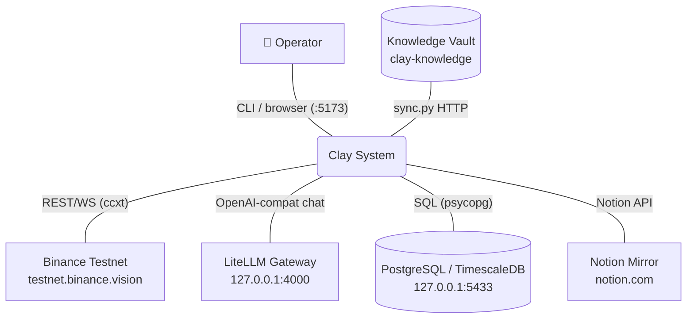
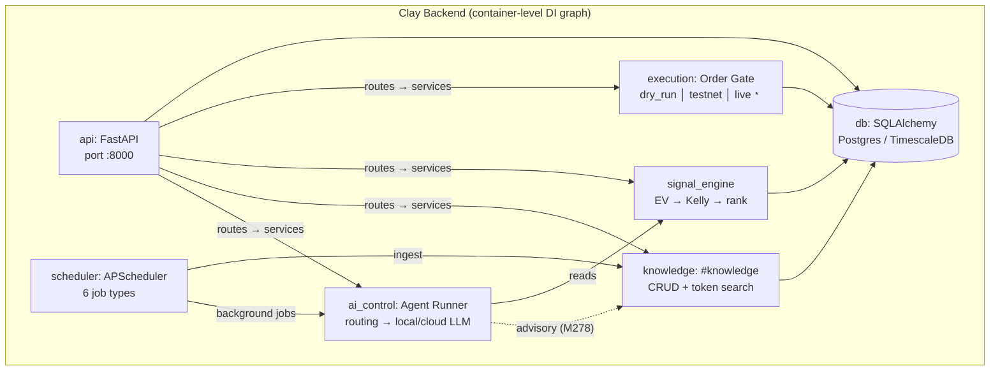

---
tags:
  - architecture
---

# Architecture Maps

## D1 — System Context (C4)

## D2 — Module Map (container-level)

> **Примечания.** `bootstrap.py` производит DI-сборку всех сервисов при import time — стрелки не показаны для читаемости. `live` execution — stub (NotImplemented), operator override required (manual `request → confirm → revoke`).
