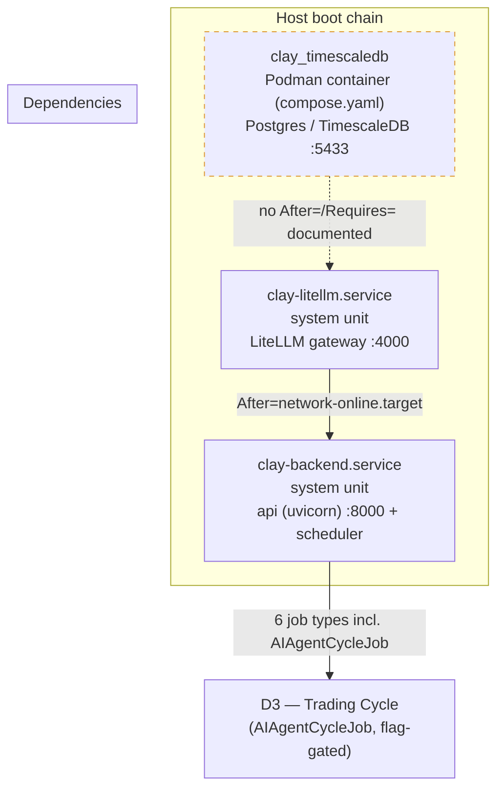

# D5 — Systemd boot-chain (as-deployed)

> **Note:** `clay_timescaledb` runs via `compose.yaml` (in-repo, `restart: unless-stopped`). Systemd units: `deploy/systemd/` (in-repo, as-deployed copy, no secrets inline). Dashed border = managed outside systemd.
