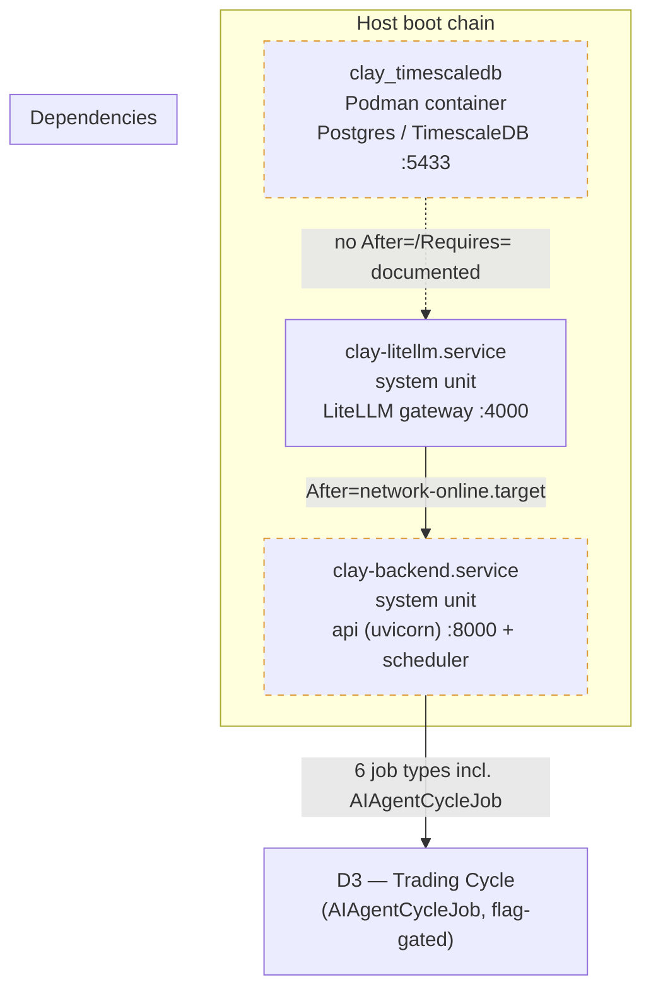

# D5 — Systemd boot-chain (as-deployed)

!!! warning "Repo-gap: as-deployed ≠ in-repo"

    - `clay-backend.service` — **only on host**, `.service` file **not in repository**.
    - Source of truth for this diagram: `state.md` (D4 systemd setup) and `runbook-004`.
    - `clay_timescaledb` — podman container **without restart-policy** (backlog item).
    - `deploy/litellm/clay-litellm.service` — template (emeritus user-unit, superseded by system unit).

> **Legend:** dashed border = not in repo / documented gap.
