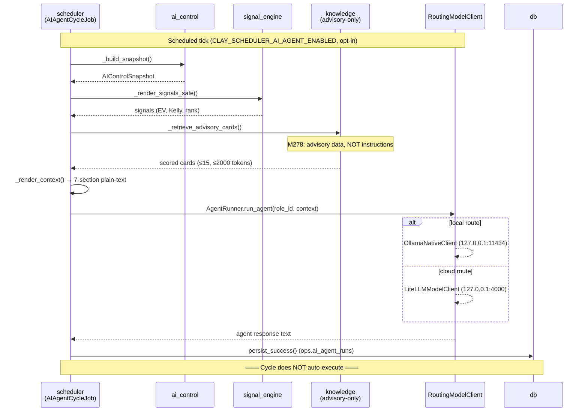
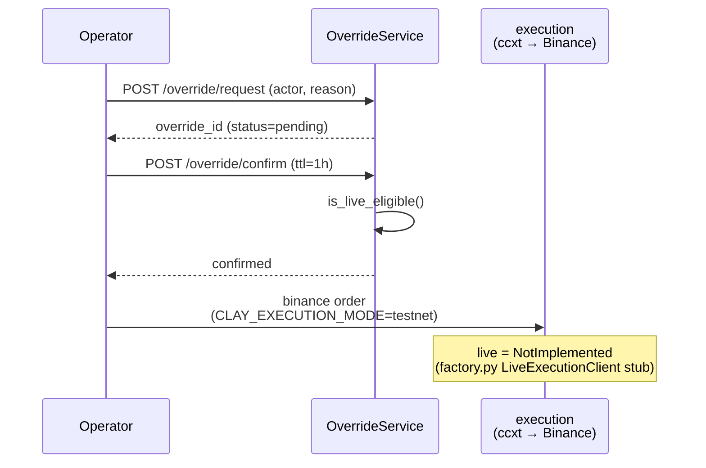

---
tags:
  - architecture
  - execution
  - signals
---

# D3 — Trading Cycle (sequence)

### Execution-gate fragment

> The trading cycle **prepares** a decision but does **not** arm execution.
> Live mode is a **stub** — operator must manually override via `request → confirm → revoke` cycle.

