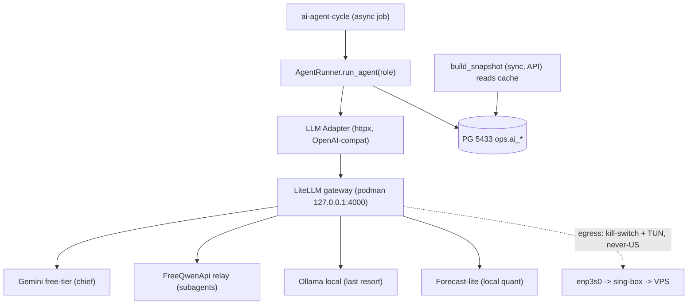

> **STATUS: SUPERSEDED (2026-06-13).** Написан до реализации кода;
> **Chief-model:** план фиксировал Gemini free-tier; текущий chief = `minimax-m3` (ADR-017 + `runbook-004`). Тело/таблицы ниже — исторические (deploy5-era baselines §8: pytest 409 / pyright 33 / ruff 47 vs recon ruff 13 — числа эпохи, не текущие).
> live-правда AI-слоя — в `blueprint-v1.md` §9–§10 и `runbooks/runbook-004`.
> Документ сохранён как исторический контекст deploy5 (слайсы 5a–5e).

# Clay DEPLOY-5 — Архитектура AI-слоя моделей (план v1.0)

> **Статус:** v1.0 · решения зафиксированы 2026-06-10 (с правом пересмотра) · ожидает финального утверждения.
> **Источник:** отчёт DEPLOY-5-RECON (R1–R9).
> **Принцип:** план и код — ревизуемые. Впереди много тестов; любой слайс можно перестроить без боли.

## Зафиксированные решения

- **1A** — Источник новостей: demo-коннекторы остаются на 5c; реальный источник (NewsAPI/X/Reddit) — отдельный под-трек позже.
- **2A** — Forecast: локальный quant (LSTM/TCN/Transformer); gemini только опц. fallback.
- **3 Gemini** — Оркестратор (chief-agent) на Gemini free-tier через шлюз.
- **4B** — Внешние LLM разрешены ТОЛЬКО через локальный шлюз за TUN + минимизация/обезличивание контекста + data-exfil политика. Право пересмотра в сторону полностью локального (A) сохраняется.

## 1. Цель

DEPLOY-5 ставит **реальный слой вызова моделей** поверх уже готового скелета `ai_control` (роли, реестр моделей, назначения в БД, governance review→apply). Сейчас модели — data-class заглушки без единого вызова API; `signal_engine` и forecast работают на детерминированной эвристике. Задача — подключить живые модели, не нарушив privacy-постуру (kill-switch, весь egress через TUN, never-US) и human-in-loop (attended-торговля).

## 2. Что показала разведка (R1–R9)

| Область | Факт | Следствие для DEPLOY-5 |
|---|---|---|
| Реестр (R1) | 5 моделей-заглушек, 4 роли, назначения в `ops.ai_assignments` | Заменить заглушки на реальные `ModelVersion` + provider-routing |
| SDK (R2) | LLM SDK нет; только `httpx` | Адаптер через `httpx` → OpenAI-совместимый шлюз (без вендор-SDK) |
| Call-site (R3) | Вызова генерации НЕТ; `provider` только в penalty/conflict | Адаптер + `AgentRunner.run_agent` пишем с нуля |
| Новости (R4) | `DemoNews`/`DemoSentiment`, реального источника нет | news-агенту нужен реальный источник — отложено (решение 1A) |
| Каданс (R5) | `build_snapshot` СИНХРОННЫЙ, зовётся из API; LLM-таймаутов нет | LLM-вызовы — в async scheduler-job, НЕ в request-path |
| Конфиг (R6) | 6 env-переменных, LLM-ключей нет | Ключи — в config шлюза (не в `.env` Clay); Clay знает только base_url |
| validation_lab (R7) | `review/apply_activation` поддерживают `target_type='model_assignment'` | 5e использует готовый governance |
| Baselines (R8) | 407 passed + 2 pre-existing fail; ruff 13 | Разобрать 2 фейла; держать зелёный |
| CLI (R9) | LiteLLM = podman-образ; coding-CLI только headless, без server | Шлюз = LiteLLM podman; CLI→endpoint только shim (dev/fallback) |

## 3. Целевая архитектура

Единая точка LLM-egress — локальный шлюз **LiteLLM** (podman, `127.0.0.1:4000`, OpenAI-совместимый). Clay общается с ним по HTTP (`httpx`), не зная вендоров. Весь внешний трафик моделей идёт через один контейнер → легко закрывается kill-switch и заворачивается в TUN.

**Слои:**

- **LiteLLM gateway** — `ghcr.io/berriai/litellm:main-stable`, bind `127.0.0.1:4000`. `config.yaml`: логические имена моделей → провайдеры. Ключи живут здесь, не в Clay.
- **LLM-адаптер** (`src/clay/llm/adapter.py`, новый) — тонкий `httpx` chat-completions клиент, structured output, таймауты, осведомлён о fallback (или делегирует fallback самому LiteLLM).
- **AgentRunner** (`ai_control`) — `run_agent(role_id, context)`: собирает промпт из входов роли, вызывает назначенную модель через адаптер, парсит в snapshot, пишет в `ops`.
- **Async-цикл** — новый scheduler-job `ai-agent-cycle` гоняет агентов ВНЕ request-path; `build_snapshot()` читает закэшированные выводы.
- **Forecast** (5d) — локальная quant-модель (обучение burst-GPU Lightning, inference локально), роль `forecast-model`.
- **Governance/A-B** — validation_lab (`target_type='model_assignment'`).

## 4. Провайдер-стратегия (по решению 4B)

| Роль | Модель (логич.) | Провайдер | Fallback |
|---|---|---|---|
| chief-agent | chief-primary | **Gemini free-tier** (через шлюз) | релей / локальный |
| market-scanner | scanner | релей (FreeQwenApi) / mini | локальный |
| news-sentiment-agent | news | релей / локальный | demo-эвристика |
| forecast-model | forecast-lite | **локальный quant** | gemini (опц.) |

Все вызовы — через шлюз. Coding-CLI (codex/claude/gemini/qwen/vibe/kimchi/openclaude — у всех headless `-p`) НЕ используются как оркестратор; максимум — dev/fallback shim (FastAPI поверх headless), т.к. server-режима у них нет (R9).

## 5. Поток выполнения

1. `ai-agent-cycle` (async, период T — подобрать под latency-бюджет) запускает роли по назначениям из `ops.ai_assignments`.
2. Для каждой роли: `AgentRunner` собирает контекст (signals/news/forecast/runtime) → адаптер → шлюз → модель.
3. Результат → `ops` (новая таблица `ai_agent_outputs` или расширение `ai_control_state`) + audit + event.
4. API / `build_snapshot()` читают последний закэшированный вывод — request-path остаётся быстрым.
5. chief-agent «не может молча переключаться» и «обязан показывать конфликты» — инвариант сохраняется (governance).

## 6. Безопасность и egress (критично)

- Весь LLM-трафик — только через gateway-контейнер на `127.0.0.1`; контейнеру разрешён egress лишь через TUN (sing-box), наружу — never-US.
- Kill-switch расширяется на gateway-контейнер: при TUN-down — модели fail-closed (агент не отдаёт вывод, сервис не падает).
- Ключи провайдеров — в `config.yaml` шлюза (НЕ в git, НЕ в Clay `.env`). Clay знает только `CLAY_LLM_BASE_URL` (+ опц. master-key шлюза).
- **Data-exfil (4B):** отправка рыночного/новостного контекста во внешние LLM = egress данных → политика минимизации/обезличивания, задокументирована в cross-cut.

## 7. Декомпозиция на слайсы

| Слайс | Цель | Ключевые файлы | Гейт |
|---|---|---|---|
| 5a | LLM-адаптер (httpx OpenAI-compat) + LiteLLM gateway (podman 127.0.0.1:4000) + `config.yaml` + `CLAY_LLM_BASE_URL`; smoke на локальном stub/Ollama (без внешних вызовов); разобрать 2 падающих теста | new `src/clay/llm/adapter.py`; compose/litellm; `.env.example` | pytest зелёный; шлюз отвечает на `/health` |
| 5b | chief-agent live: `AgentRunner.run_agent` + scheduler-job `ai-agent-cycle` (async) + persist в `ops` + latency + kill-switch (TUN-down → fail-closed, 0 утечки) | `ai_control/service.py`, `runner.py`; `settings/scheduler.py`; `api/lifespan.py` | latency ≤ budget; TUN-down тест 0 leak |
| 5c | субагенты market-scanner + news-sentiment live; news = demo (решение 1A) | `ai_control`; `ingestion/context` | snapshot с реальными выводами |
| 5d | forecast quant: dataset из `market.market_bars` → train (Lightning burst) → локальный inference → роль `forecast-model` | new forecast service; `forecast-lite-v1` | бэктест-метрики |
| 5e | validation_lab A/B (model_comparison) + governed activation (`review/apply` `target_type=model_assignment`) + latency | `validation_lab/service.py` | A/B-отчёт; governed switch |
| cross-cut | секреты в config шлюза (не git), geo-allowlist, data-exfil политика, egress-аудит, kill-switch на gateway-контейнер | killswitch nft; docs | политика задокументирована |

## 8. Гейты и baselines

- Эталоны: pytest **409**, pyright **33**, ruff **47**. Recon: сейчас **407 passed + 2 pre-existing fail**, ruff **13**.
- Два падающих теста (`test_main_host_default`, `test_ingestion_settings_expose_v1_timeframes`) — разобрать в 5a: починить либо зафиксировать новый baseline. `test_main_host_default` может быть связан с FOOTGUN B (`CLAY_SERVER_HOST=127.0.0.1`).
- Каждый слайс: зелёный pytest/pyright/ruff + специфичный гейт (latency, kill-switch TUN-down 0 leak, A/B-отчёт).

## 9. Чего НЕ делаем

- Не трогаем v2rayN/sing-box из кода (FOOTGUN C) — туннель поднимает только оператор.
- Не пишем код до финального утверждения плана.
- Не используем coding-CLI как оркестратор (нет server-режима; только опц. shim).
- Не трогаем live-5432; миграции/запросы только на 5433.

## 10. Принцип ревизуемости

План и код держим модульными и обратимыми: каждый слайс проходит отдельный цикл (Архитектор → Emma → агент → отчёт → ратификация) и может быть пересмотрен по результатам тестов. Решения §«Зафиксированные решения» — дефолты, а не догма; смена (например 4B→4A «полностью локально») допускается на любом этапе с обновлением этого документа.
