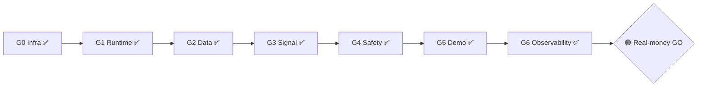

# CLAY — Release Gates G0–G6 (формальный спек)

Дата: 2026-06-29
Статус: v1 — ratified (Tier-0 W2)
Владелец: Архитектор (ратификация критериев) · Emma (продуктовый sign-off)
Закрывает: `execution-backlog-v1.md` → Task `E12.4` («Описать release gates»)
Канон: AI advisory-only · real-money = осознанное продуктовое решение (не автомат, инвариант Q5)

## 0. Зачем этот документ

Критерии готовности `G0–G6` исторически были размазаны по архиву (Том 1) и роадмапу,
а карточка «Gate-проверки G0–G6» оставалась пустой. Это — единый источник истины:
**что именно делает каждый гейт пройденным, зачем он нужен и в каком он статусе сейчас.**
Все гейты зелёные ⇒ снят технический блокер перехода demo → real-money (решение принимает Emma).

## 1. Модель готовности (два слоя + кольца)

- **Инженерные гейты `G0–G6`** — корректность и эксплуатационная готовность системы (этот документ).
- **Release-rings `Ring 0→3`** — продуктовая модель раскатки риска (см. §5).
- **Real-money GO** — человеческая точка решения между Ring 0 и Ring 1.

## 2. Гейты G0–G6 — критерии и статус

### G0 — Infra bring-up ✅
- **Критерий прохода:** TimescaleDB 2.27.1 @ `5433` поднимается и переживает ребут (`restart=always`); kill-switch изолирует Clay (uid 945) — egress только через `singbox_tun`, fail-closed на любом другом интерфейсе; LiteLLM-шлюз liveliness (port 4000).
- **Зачем:** безопасный изолированный хост — данные и AI-egress под контролем, без утечек и без ручного babysitting.
- **Статус:** ✅ — DEPLOY-3.5e + DB-AUTOSTART, ребут-гейт зелёный.

### G1 — Runtime stability ✅
- **Критерий прохода:** scheduler с 4 джобами (health / reliability / ingestion / retention), 0 джобов исполняют сделки; health-endpoints; degraded-mode «громкий» (виден в UI и audit); непрерывный health > 24ч перед GO.
- **Зачем:** система работает сама и честно сообщает о деградации, а не молчит.
- **Статус:** ✅ — механика ✅ (джобы, degraded-mode, health) + **контрольный 24ч-soak пройден** (2026-06-30): 145 сэмплов / 144 строго healthy; единственная аномалия 13:32 — operator TUN-свитч v2rayN (артефакт пробы, не сервиса; самовосстановление <10мин, процесс не падал); scheduler 4 джобы, 0 трейдовых.

### G2 — Data integrity ✅
- **Критерий прохода:** миграции без дрейфа (`G2.1` no-op / `G2.2` round-trip / `G2.3` no-drift), alembic head `0015`; freshness/retention-политики работают; нет рассинхрона freshness между signal-pipeline и workspace.
- **Зачем:** решения принимаются на консистентных, свежих данных.
- **Статус:** ✅ — миграции ✅; **Finding L закрыт** (freshness dual-policy выровнен: per-pair worst-of в shortlist + гейтинг по свежести фокусной пары + advisory `monitored_data_health`; L2 `3aea771` / L3a `b38df40` / L3b `bb3a246`, ADR-026). Рассинхрон pipeline↔workspace устранён.

### G3 — Signal quality ✅
- **Критерий прохода:** R3 — нижний порог объёма (min-volume floor) как guard против ложной «высокой ликвидности» на тихом рынке (anti-slippage); установлен demo win-rate baseline (≥20 сессий).
- **Зачем:** сигнал не обманывает на неликвиде; есть измеримая база качества.
- **Статус:** ✅ — **R3 закрыт** (min-volume floor guard, ADR-027; squash `0f418d5`, PR #5, CI #28382355347). Dual-tier: advisory-флаг (1M) + жёсткий `min_quote_volume_floor` (env `CLAY_MIN_QUOTE_VOLUME_FLOOR`, дефолт 0.0=off, прод-ориентир ~250k) → `block_signal`/invalidated. Win-rate baseline зафиксирован: **20 demo-сессий** (при пороге ≥5).

### G4 — Safety & audit ✅
- **Критерий прохода:** Q5 manual-only (0 авто-исполнения — структурный инвариант); confirm на всех destructive-действиях; полный audit-trail (actor / module / object / explanation); код-гигиена как safety-floor — pyright 0 blocking, ruff 0, FOOTGUN B (bind только `127.0.0.1`).
- **Зачем:** ни одной тихой сделки; каждое действие объяснимо и подтверждено человеком.
- **Статус:** ✅ — Q5 держится; FOOTGUN B закрыт; pyright/ruff 0 после S-LINT 1+2. Сильнейший гейт.

### G5 — Live/demo sessions ✅
- **Критерий прохода:** торговый FSM валидирован end-to-end на ≥5 живых demo-сессиях (G5b seed-harness).
- **Зачем:** дисциплина сессии (preflight → briefing → active → review) доказана на практике, не на бумаге.
- **Статус:** ✅ — перевыполнен (20/5).

### G6 — Observability & tuning ✅
- **Критерий прохода:** осознанные caveats закрыты или видимы в briefing — Finding M (ai-conflict penalty), Finding L (freshness), R3 (liquidity); наблюдаемость сигнала и сессии.
- **Зачем:** остаточные риски либо устранены, либо честно показаны оператору.
- **Статус:** ✅ — **Finding M ✅ (ADR-017)** + **Finding L ✅ (ADR-026)** + **R3 ✅ (ADR-027)** закрыты. Все осознанные caveats сняты.

## 3. Сводная таблица статуса

| Гейт | Что проверяет | Статус | Блокер |
|---|---|---|---|
| G0 Infra bring-up | БД autostart + kill-switch + шлюз | ✅ | — |
| G1 Runtime stability | scheduler / degraded-mode / health > 24ч | ✅ | — (24ч-soak ✅) |
| G2 Data integrity | миграции no-drift + freshness | ✅ | — |
| G3 Signal quality | R3 min-volume + win-rate baseline | ✅ | — (R3 + 20/5) |
| G4 Safety & audit | Q5 + confirm + audit + lint/pyright 0 + FOOTGUN B | ✅ | — |
| G5 Live/demo sessions | FSM ≥5 живых сессий | ✅ | — (20/5) |
| G6 Observability & tuning | Finding L/M + R3 + наблюдаемость | ✅ | — |

## 4. Что осталось до GO (открытые хвосты)

Все гейты зелёные — **7 из 7** (G0–G6). Технический блокер перехода demo → real-money снят; решение о real-money принимает человек (Emma, Q5).

✅ **24ч-soak пройден** (2026-06-30) — непрерывный health 24ч+ (145 сэмплов / 144 строго `healthy`; единственная аномалия 13:32 — operator TUN-свитч v2rayN, артефакт пробы, не сервиса): закрыл **последний** гейт G1.

✅ **R3 закрыт** (2026-06-29) — min-volume floor guard (squash `0f418d5`, PR #5, ADR-027): закрыл G3 и снял последний блокер G6.
✅ **Finding L закрыт** (2026-06-29) — freshness dual-policy выровнен (L2 `3aea771` → L3a `b38df40` → L3b `bb3a246`, ADR-026): закрыл G2, снял половину G6.

Дополнительно — **E12.5 (UI E2E аудит + полировка запуска)** как пре-реквизит входа в Ring 1.

## 5. Real-money GO + release-rings

**Real-money GO** = продуктовый sign-off Emma. Это **не автомат**: система никогда не переключится на реальные деньги сама (Q5). Зелёные гейты дают *право* принять решение; решение принимает человек.

- **Ring 0 — Local demo:** текущее состояние, ручное исполнение, 0 реальных денег.
- **Ring 1 — Real, минимальный лимит:** реальные деньги малым фиксированным лимитом, усиленное наблюдение. **Вход:** все `G0–G6` зелёные + `E12.5` пройден + 24ч-soak + Emma GO.
- **Ring 2 — Real, рабочий режим:** лимиты по результатам Ring 1.
- **Ring 3 — Второй оператор / расширение** (Later).

## 6. Связанные артефакты

- **Roadmap:** `Clay — Product Roadmap & PRD v1` — §B3 product gates + кольца (источник модели Rings).
- **Notion:** «Clay — Hardening до real-money: чек-лист» (операционный Tier-0 трекер) · «Architect Working Log Том 3» (Tier-0 W1/W2).
- **ADR:** ADR-009 (egress) · ADR-017 (Finding M / all-Google homo) · ADR-026 (Finding L / freshness dual-policy) · ADR-027 (R3 / min-volume floor guard) · Tier-3 (после GO): ADR-018 (ccxt) / ADR-019 (freqtrade-protections) / ADR-020 (Kelly + EV-gate).
- **Runbooks:** runbook-001 (preflight / degraded) · runbook-003 (kill-switch) · runbook-004 (gateway).
- **Backlog:** `execution-backlog-v1.md` → Task `E12.4` (закрыта этим документом), Task `E12.5` (UI E2E — пре-реквизит Ring 1).
